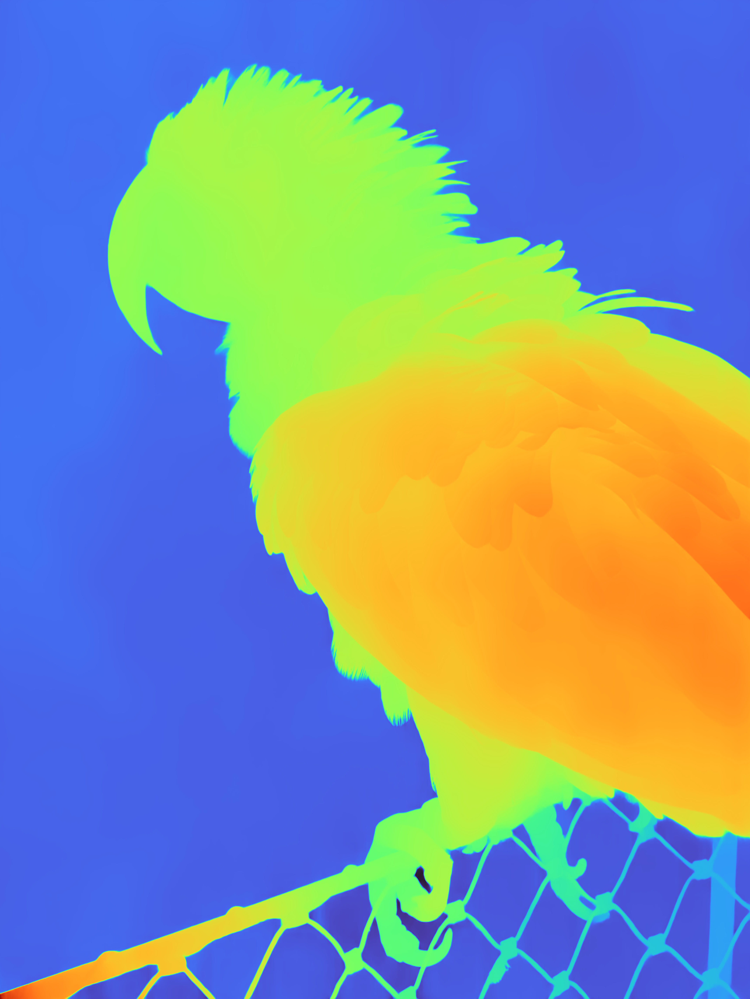

# Brioche 🍞

<p align="center">
  
</p>

Brioche is a Rust implementation of the [ml-depth-pro](https://github.com/apple/ml-depth-pro#9efe5c1def37a26c5367a71df664b18e1306c708) repository which re-implements the depth-pro neural network model using [Burn](https://github.com/tracel-ai/burn). It uses the [ONNX](https://onnx.ai/) to load the underlying [vit_large_patch14_dinov2](https://huggingface.co/timm/vit_large_patch14_dinov2.lvd142m) model and weights which are exported from python. The exported python script is located in the [butter](./butter) folder.

## Output example below

<p align="center">
  
  
</p>

## Requirements

- You'll need to have the latest version of [Rust](https://www.rust-lang.org/tools/install) installed.
- You'll need to have the [uv package manager](https://docs.astral.sh/uv/) installed. Once you have it installed, you can install the required dependencies by running the following command in the **butter** folder:

```sh
uv sync
```

1. Download the depth-pro checkpoint file by running the following command in the **butter** folder: 

```sh
uv run vit_exporter.py --download-checkpoint --checkpoint-path ./depth_pro.pt
```

2. Export the ONNX model & weights by running the following script:

```sh
uv run vit_exporter.py --checkpoint-path ./depth_pro.pt
```

3. Export the weights for the network model by running the following command:

```sh
uv run state_exporter.py --fov --checkpoint-path ./depth_pro.pt
uv run state_exporter.py --encoder --checkpoint-path ./depth_pro.pt
uv run state_exporter.py --decoder --checkpoint-path ./depth_pro.pt
uv run state_exporter.py --head --checkpoint-path ./depth_pro.pt
```

4. Once you have all these files you should be able to run the sample using this command from the **root** folder of this repository.

```sh
cargo run --release --example sample_metal --features="metal"
```

## Half precision

The project supports half precision (f16) for the network model. In order to use it. You'll first need to export the ONNX model & weights for half precision by running the following command:

```sh
uv run vit_exporter.py --checkpoint-path ./depth_pro.pt --half
```

Once it's done. You can use the following command to run the sample which uses the **half precision (f16)**, by running the following command:

```sh
cargo run --release --example sample_metal --features="metal,f16" --no-default-features```
```

## Note ⚠️

This project is not production ready. It's a work that is done for educational purposes. There's currently an overhead when converting a CPU tensor from ONNX to GPU tensor for Burn which is not ideal for production use. Below is a performance table

| Device                | Precision          | Time (s) |
|-----------------------|--------------------|----------|
| MacBook Pro M1 Pro    | Full Precision     | 125      |
| MacBook Pro M1 Pro    | Half Precision     | 141      |
| MacBook Pro M4 Pro    | Full Precision     | 32       |
| MacBook Pro M4 Pro    | Half Precision     | 35       |


## Reference

Credits to the depth-pro team for open-sourcing their work.

```bibtex
@inproceedings{Bochkovskii2024:arxiv,
  author     = {Aleksei Bochkovskii and Ama\"{e}l Delaunoy and Hugo Germain and Marcel Santos and
               Yichao Zhou and Stephan R. Richter and Vladlen Koltun},
  title      = {Depth Pro: Sharp Monocular Metric Depth in Less Than a Second},
  booktitle  = {International Conference on Learning Representations},
  year       = {2025},
  url        = {https://arxiv.org/abs/2410.02073},
}
```
